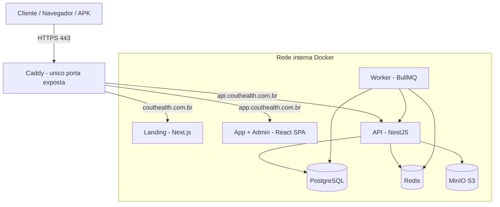

# CoutHealth — Escopo do Projeto

> Plataforma digital de acompanhamento contínuo em saúde (nutrição + treino) para **Rafael Coutinho — Personal Trainer e Nutricionista**.
> Domínio: **couthealth.com.br**
> Marca: **COUT / CoutHealth**

---

## 1. Visão geral

A CoutHealth **não vende dieta nem treino**. Vende **acompanhamento profissional contínuo**. A tecnologia trabalha nos bastidores: organiza, automatiza e potencializa o cuidado. **Toda decisão clínica é humana** — nenhum plano é gerado ou publicado sem revisão de um profissional.

Frase-guia do produto (do briefing), que deve orientar toda decisão:

> A CoutHealth cria um **ciclo contínuo de acompanhamento profissional**, onde a tecnologia organiza, automatiza e potencializa o cuidado, enquanto as decisões clínicas permanecem sempre sob responsabilidade da equipe de saúde.

O projeto tem **três frentes**:

1. **Landing page** — site institucional/comercial que converte visitante em conta criada.
2. **Plataforma (área do cliente)** — SaaS web responsivo, depois empacotado com **Capacitor → APK Android**.
3. **Painel administrativo** — onde o profissional analisa anamneses, publica planos/treinos e gerencia tudo sem tocar em código.

Referência de posicionamento visual/UX: **Apple, Oura, Whoop** — premium, minimalista, health-tech. **Evitar cara de "app de academia".**

---

## 2. Princípios inegociáveis (regras de produto)

Estes princípios têm precedência sobre qualquer feature:

1. **Decisão clínica sempre humana.** A plataforma **não** gera dieta automaticamente, **não** gera treino automaticamente, **não** substitui nutricionista nem profissional de Educação Física.
2. **Todo plano/treino passa por revisão e publicação de um profissional** antes de chegar ao cliente.
3. **A IA nunca publica planos e nunca responde como profissional.** A arquitetura deve *permitir* IA no futuro (resumir anamnese, organizar dados, sugerir rascunho preliminar, priorizar pacientes, resumir check-ins) — sempre como **apoio interno**, nunca como saída final ao cliente.
4. **Administração sem código.** Cadastro de alimentos, exercícios, receitas, artigos, vídeos, materiais, cupons, notificações, planos e assinaturas — tudo via painel.
5. **Dados de saúde = dados sensíveis (LGPD).** Tratamento com consentimento, criptografia, controle de acesso e trilha de auditoria (ver §9).

---

## 3. Escopo do produto

### 3.1 Landing page (público)
Objetivo único: **criar conta**. Estrutura sugerida (inspirada na referência dark que o cliente aprovou, com paleta da marca — preto + amarelo):

- Hero com headline forte + CTA "Criar conta" + badge de credibilidade.
- Bloco "O problema não é você — é o método" (dor → solução).
- "Como funciona" (o ciclo: cadastro → anamnese → análise profissional → publicação → acompanhamento).
- Diferenciais (tecnologia + profissional; o cuidado contínuo).
- Prova social / depoimentos.
- Bloco do app (mockups mobile).
- Planos (Essencial / Plus / Elite) com toggle de período.
- FAQ (accordion).
- CTA final + rodapé.

### 3.2 Plataforma — Área do cliente (web + APK)
Módulos (mapeados do briefing):

| Módulo | Conteúdo |
|---|---|
| **Dashboard** | Resumo geral, próximas notificações, últimos planos, últimas mensagens, próxima revisão |
| **Nutrição** | Plano alimentar por refeição (horário, alimentos, quantidades, observações; macros e kcal por 100 g) |
| **Treino** | Treinos por letra (A, A+B, A+B+C…); por exercício: séries, repetições, carga*, intervalo*, observações, vídeo demonstrativo |
| **Biblioteca** | Receitas, artigos, vídeos, materiais educativos (publicados pelo admin) |
| **Mensagens** | Sistema interno cliente ↔ equipe (não precisa ser tempo real) |
| **Notificações** | Automáticas (plano publicado, treino atualizado, mensagem, conteúdo novo) + personalizadas |
| **Evolução** | Gráficos: peso, cintura, abdômen, braço, coxa, massa muscular, massa de gordura |
| **Acompanhamento / Check-ins** | Mensagens automáticas → depois check-ins inteligentes (nutrição e treino), respostas registradas |
| **Perfil / Avaliação física** | Dados pessoais + histórico de avaliações |

\* opcional

### 3.3 Painel administrativo
CRUD e gestão, tudo sem código:
- Clientes (cadastrar, ver, gerenciar).
- Anamnese (receber, interpretar, analisar).
- Publicar plano alimentar e treino.
- Banco de Alimentos (~50 iniciais, expansível).
- Banco de Exercícios (~50 iniciais, expansível).
- Receitas, vídeos, artigos, materiais.
- Notificações personalizadas (promoções, avisos, campanhas, lembretes).
- Cupons.
- Planos e assinaturas.
- Mensagens com clientes.

---

## 4. Arquitetura técnica

### 4.1 Princípio de rede
Todos os containers em rede **interna**; **uma única porta pública** exposta por um reverse proxy (**Caddy**, com HTTPS automático). Roteamento por subdomínio:

- `couthealth.com.br` → **landing**
- `app.couthealth.com.br` → **app do cliente** (e `/admin` → painel)
- `api.couthealth.com.br` → **API**

### 4.2 Stack recomendada
Alinhada ao seu padrão (Next/React + TS + Postgres + Prisma + Docker) e ao requisito do Capacitor:

- **Landing:** Next.js (SSR/SSG p/ SEO e performance).
- **App + Admin:** **React SPA (Vite + TypeScript)** — caminho mais limpo para empacotar com **Capacitor** e gerar o APK. Mesmo app, com rotas `/app/*` e `/admin/*` protegidas por papel.
- **API:** **NestJS** (modular, DTOs validados, guards de RBAC) + **Prisma** + **PostgreSQL**.
- **Fila/agendamento:** **Redis + BullMQ** (lembretes de anamnese, check-ins automáticos, disparo de notificações).
- **Storage de arquivos:** **MinIO** (S3-compatível, self-host) para imagens, PDFs e materiais.
- **Vídeos de exercício:** iniciar com **YouTube (não listado) incorporado** (custo/performance, como o briefing permite); arquitetura pronta para trocar por MinIO/Cloudflare Stream depois.
- **Auth:** e-mail/senha + **Login com Google (OAuth)**; **Apple depois**. JWT + refresh; RBAC (cliente / profissional-admin).
- **Push (APK):** FCM via Capacitor (fase posterior).
- **Reverse proxy:** Caddy (única porta exposta).

> Decisão em aberto: **gateway de pagamento** (ver §8 e §12).

### 4.3 Diagrama de containers

### 4.4 Serviços do `docker-compose`
`caddy` (público) · `landing` · `app` (build estático servido pelo Caddy) · `api` · `worker` · `postgres` · `redis` · `minio`. Volumes persistentes para Postgres, MinIO e certificados do Caddy. Rotina de **backup** do Postgres agendada.

### 4.5 Capacitor → APK
O app do cliente (React SPA) é buildado e empacotado com Capacitor apontando para `api.couthealth.com.br`. Recursos nativos previstos: push (FCM), splash/ícone com a marca, e futuramente câmera (foto de progresso). Landing e Admin **não** entram no APK — só a área do cliente.

---

## 5. Modelo de domínio (entidades principais)
`User` (papel: client | professional/admin) · `Subscription` (plano, período, status) · `Plan` (Essencial/Plus/Elite) · `Coupon` · `Payment` · `Anamnesis` (formulário único, com status: rascunho/enviada/analisada) · `MealPlan` → `Meal` → `MealItem` · `Workout` (A..E) → `Exercise` → `ExerciseLog` · `Food` (banco de alimentos) · `ExerciseLibrary` (banco de exercícios) · `LibraryContent` (receita/artigo/vídeo/material) · `Message` / `Thread` · `Notification` · `Assessment` (avaliação física / medidas) · `CheckIn` · `AuditLog`.

---

## 6. Fluxos principais

### 6.1 Onboarding (anamnese única)
Descoberta → Landing → **Cadastro** (e-mail/senha ou Google) → **Escolha do plano** (Essencial/Plus/Elite × Mensal/Trimestral/Semestral/Anual, com desconto por período + cupom) → **Pagamento** (liberação automática) → **Anamnese única** integrando nutrição + treino + saúde + hábitos.

A anamnese deve ter **"Responder depois"**: salva progresso automaticamente e dispara lembretes até a conclusão. Campos completos do formulário estão detalhados no §7.1.

### 6.2 Análise → Publicação
Anamnese finalizada → profissional recebe todos os dados → interpreta/analisa/decide/monta estratégia → (se faltar dado, **pergunta pelo chat interno** antes de publicar) → publica plano alimentar + treino → cliente recebe **notificação**.

### 6.3 Acompanhamento contínuo
Início: mensagens automáticas. Depois: **check-ins inteligentes** (nutrição: seguiu o plano? maior dificuldade? conseguiu organizar refeições? / treino: conseguiu treinar? algum exercício incomodou? sentindo dores?). Respostas ficam **registradas** no histórico do cliente.

---

## 7. Detalhamento de módulos

### 7.1 Anamnese (formulário único)
- **Dados pessoais:** nome, sexo, idade, altura, peso, profissão.
- **Objetivo:** emagrecer / ganhar massa / saúde / longevidade + campo aberto "O que você espera conquistar?".
- **Alimentação:** refeições/dia, água, alimentos preferidos, que não gosta, suplementos, alergias, intolerâncias, dietas anteriores.
- **Saúde:** doenças, medicamentos, cirurgias, exames alterados, deficiências nutricionais, problemas ortopédicos, histórico familiar.
- **Sono:** qualidade, horas, horário que dorme/acorda.
- **Função intestinal:** normal / constipação / diarreia / irregular.
- **Hábitos:** fuma, bebe.
- **Exercícios:** sedentário/ativo, há quanto tempo, dias/semana, modalidade, equipamentos disponíveis, exercícios que provocam dor, que prefere evitar.
- **Avaliação física inicial:** altura (cadastro); avaliações: peso, circunferência abdominal, cintura, braço, coxa; opcional: massa muscular, massa de gordura.

### 7.2 Nutrição
Plano por refeição: horário, alimentos, quantidades, observações. Cada alimento exibe **kcal / proteínas / carboidratos / gorduras por 100 g**.

### 7.3 Treino
Treinos por letra conforme o cliente (A; A+B; A+B+C…). Por exercício: séries, repetições, carga (opcional), intervalo (opcional), observações, **vídeo demonstrativo** (YouTube não listado na fase 1).

### 7.4 Bancos
- **Alimentos (~50):** nome, categoria, kcal, proteínas, carboidratos, gorduras, observações.
- **Exercícios (~50):** nome, grupo muscular, descrição, vídeo.
Ambos preparados para expansão.

### 7.5 Evolução
Gráficos de medidas ao longo do tempo. Se o cliente não tiver dados no início, tudo bem — preenche depois.

---

## 8. Planos, pagamentos e cupons

| Plano | Inclui |
|---|---|
| **Essencial** | Plano alimentar, treino, biblioteca, mensagens, notificações, check-ins, **revisão 1×/mês** |
| **Plus** | Tudo do Essencial + **revisão a cada 15 dias**, atendimento prioritário, check-ins mais frequentes (sem teleconsulta) |
| **Elite** | Tudo do Plus + **1 teleconsulta mensal (até 1h)** |

- **Períodos:** Mensal, Trimestral, Semestral, Anual — **quanto maior o período, maior o desconto**.
- **Cupons:** sistema de desconto configurável no admin.
- **Pagamento aprovado → conta liberada automaticamente.**
- **Gateway:** definir (recomendo um com **PIX + cartão recorrente** para o Brasil — ex.: Asaas, Pagar.me ou Mercado Pago; Stripe se preferir). Ver §12.

---

## 9. Requisitos não-funcionais

- **LGPD / dados sensíveis de saúde:** consentimento explícito no cadastro, política de privacidade e termos, criptografia em trânsito (TLS) e em repouso onde aplicável, controle de acesso por papel, **trilha de auditoria** (quem acessou/alterou o quê), e fluxo de exclusão/portabilidade de dados.
- **Segurança:** JWT + refresh, hashing de senha (argon2/bcrypt), rate limiting, validação de entrada (DTO), CORS restrito, secrets fora do código (`.env` não versionado).
- **Performance:** landing com bom Lighthouse; app responsivo e leve (importante para o APK).
- **Design:** simples, intuitivo, rápido, elegante, modular, escalável (padrão Apple/Oura/Whoop).
- **Observabilidade:** logs estruturados + healthchecks nos containers.
- **Backups:** rotina automática do Postgres + MinIO.

---

## 10. Camada de IA (futuro — não bloqueia MVP)
Abstração desde já (interface de "assistente interno") para, depois: resumir anamnese, organizar informações, sugerir **rascunho** preliminar de dieta/treino (revisado pelo profissional), destacar pacientes prioritários, resumir check-ins. **Nunca publica, nunca fala como profissional.** Provider provável: Claude API atrás de um serviço interno.

---

## 11. Etapas / Roadmap (fases com "Definition of Done")

Sugestão de execução com uso intensivo de **Claude Code + Stitch MCP** (todas as telas geradas no Stitch **antes** de codar o front — ver `design-stitch.md`).

**Fase 0 — Fundação**
- Repositório + estrutura de monorepo (landing / app / api / worker / infra).
- `docker-compose` com Caddy, Postgres, Redis, MinIO; healthchecks.
- Design tokens e componentes base derivados do manual da marca.
- *DoD:* `docker compose up` sobe tudo; landing "hello" acessível por HTTPS local.

**Fase 1 — Design no Stitch**
- Gerar **todas as telas** (desktop + mobile) no Stitch via MCP, seguindo `design-stitch.md`.
- *DoD:* projeto Stitch com o inventário completo de telas aprovado pelo cliente.

**Fase 2 — Landing page (3 variantes para o cliente escolher)**
- Implementar **3 landings distintas** (Next.js) a partir das 3 direções do Stitch (ver `design-stitch.md` §8A), navegáveis em `/`, `/v2`, `/v3`. SEO, performance, CTA → cadastro. Padrão profissional (nível de estúdio, sem cara de template).
- *DoD:* as 3 variantes publicadas e responsivas, validadas no Playwright (desktop + mobile, sem erros de console, screenshots capturados). Cliente escolhe uma; a escolhida assume `/`.

**Fase 3 — Auth + Planos + Pagamento**
- Cadastro (e-mail/senha + Google), escolha de plano/período, cupons, integração do gateway, liberação automática.
- *DoD:* usuário cria conta, paga e é liberado ponta a ponta.

**Fase 4 — Onboarding (anamnese única)**
- Formulário único com salvar/"Responder depois" + lembretes.
- *DoD:* anamnese completa persistida; retomada de rascunho funciona.

**Fase 5 — Painel do profissional (análise → publicação)**
- Ver anamnese, mensagens internas, montar e **publicar** plano alimentar + treino; notificação ao cliente.
- Bancos de alimentos/exercícios; receitas/artigos/vídeos/materiais.
- *DoD:* profissional publica plano+treino e o cliente recebe notificação.

**Fase 6 — Área do cliente (consumo)**
- Dashboard, Nutrição, Treino (com vídeos), Biblioteca, Mensagens, Notificações, Perfil.
- *DoD:* cliente visualiza tudo o que foi publicado.

**Fase 7 — Evolução + Check-ins**
- Gráficos de medidas; mensagens automáticas → check-ins inteligentes; histórico registrado.
- *DoD:* cliente registra medidas, vê gráficos e responde check-ins.

**Fase 8 — Admin de notificações/cupons/assinaturas**
- Notificações personalizadas, gestão de cupons, planos e assinaturas — sem código.
- *DoD:* admin opera campanhas e assinaturas sozinho.

**Fase 9 — APK (Capacitor)**
- Empacotar app do cliente; push (FCM); ícone/splash da marca; build do APK.
- *DoD:* APK instala e roda contra a API de produção.

**Fase 10 — Hardening + LGPD + Go-live**
- Auditoria, backups, política/termos, revisão de segurança, deploy no VPS.
- *DoD:* produção estável em couthealth.com.br.

**Fase futura — IA de apoio** (§10).

### 11.1 Portões de validação (Playwright MCP)
Toda fase que gera UI ou fluxo só é considerada concluída após validação automatizada com **Playwright MCP**:
- Subir o ambiente (`docker compose up`) e navegar as telas da fase.
- Verificar renderização, **ausência de erros no console**, e responsividade (desktop + mobile).
- Capturar **screenshots** em `/screenshots/<fase>/`.
- Para fluxos críticos (cadastro → pagamento → liberação → anamnese; publicação de plano → notificação), rodar **e2e** ponta a ponta.
- Só então commitar/pushar e seguir para a próxima fase.

### 11.2 Autonomia de execução
O agente executa **fase a fase sem pedir confirmação**. Diante de ambiguidade, adota o **default assumido** (§13.0), registra a decisão em `DECISIONS.md` e segue. Commit + push a cada fase (Conventional Commits).

---

## 12. Repositório & Git
Padrão de trabalho: **empurrar para o GitHub após cada mudança.** Antes de criar o repositório, preciso do **nome do repo** (ou o link, se já existir). Sugestão de nome: `couthealth` ou `couthealth-plataforma` — me confirma qual usar.

---

## 13.0 Defaults assumidos (para execução autônoma)
Enquanto os itens do §13 não forem confirmados, o agente **assume estes defaults** e não interrompe o trabalho (registrar em `DECISIONS.md`):

- **Fonte:** `Space Grotesk` (display) + `Inter` (corpo). Se `logo.svg/png` e arquivos `.woff2` da **Luxora Grotesk** existirem na raiz, usá-los automaticamente.
- **Pagamento:** implementar atrás de uma interface `PaymentProvider` com **adapter mock funcional** (libera conta em dev) e **adapter Asaas** (PIX + cartão recorrente) pronto para receber chaves via `.env`. Nada de bloquear por falta de chave real.
- **Vídeos de exercício:** YouTube não listado (embed).
- **Storage:** MinIO para imagens/PDFs/materiais.
- **Auth:** e-mail/senha + Google (credenciais via `.env`, com placeholders); Apple depois.
- **Papéis:** `client` e `professional/admin` (um admin — Rafael — já preparado para múltiplos profissionais).
- **Push (APK):** estrutura pronta (FCM), ativação em fase posterior.
- **Preços/descontos:** usar valores placeholder configuráveis no admin até o cliente definir.
- **Teleconsulta (Elite):** campo de link de reunião (Meet/Jitsi) no admin, sem integração nativa no MVP.
- **Seeds:** popular ~50 alimentos e ~50 exercícios de exemplo.

## 13. Informações que ainda preciso de você / cliente

1. **Logo** (svg/png na raiz) e **fonte Luxora Grotesk**: existe licença web (arquivos `.woff2`)? Se não, uso fallback grotesk (ex.: Space Grotesk) — ok?
2. **Gateway de pagamento** de preferência e formas (PIX / boleto / cartão recorrente).
3. **Preços exatos** por plano e **% de desconto** por período (o PDF define os planos, mas não os valores).
4. **Teleconsulta (Elite):** ferramenta de vídeo (Meet/Jitsi/Whereby/Daily) ou só envio de link?
5. **Vídeos de exercício:** YouTube não listado (recomendado no início) ou upload de arquivos? Quem produz?
6. **Push no APK:** quer notificações push (FCM) já na primeira versão do app?
7. **Equipe:** por ora só o Rafael como admin, ou já haverá múltiplos profissionais (afeta papéis/permissões)?
8. **Google OAuth:** você provê as credenciais (Google Cloud) ou eu configuro?
9. **Infra:** qual VPS (Contabo/Hetzner) e acesso ao DNS de couthealth.com.br?
10. **Jurídico/LGPD:** quem fornece política de privacidade e termos (dados de saúde exigem cuidado)?
11. **Nome do repositório GitHub** (ver §12).

---

## 14. Checklist de acompanhamento
- [ ] Nome do repo confirmado e criado
- [ ] Fonte/licença e logo recebidos
- [ ] Gateway e preços definidos
- [ ] Telas geradas no Stitch (Fase 1) aprovadas
- [ ] Landing no ar
- [ ] Fluxo cadastro→pagamento→liberação
- [ ] Anamnese com "Responder depois"
- [ ] Publicação de plano+treino pelo admin
- [ ] Área do cliente completa
- [ ] Evolução + check-ins
- [ ] APK gerado
- [ ] LGPD/segurança/backup revisados
- [ ] Go-live couthealth.com.br
